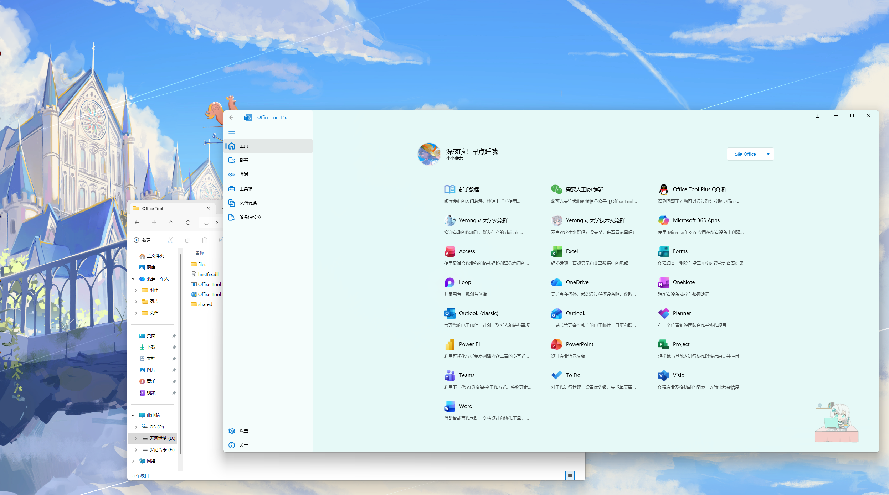
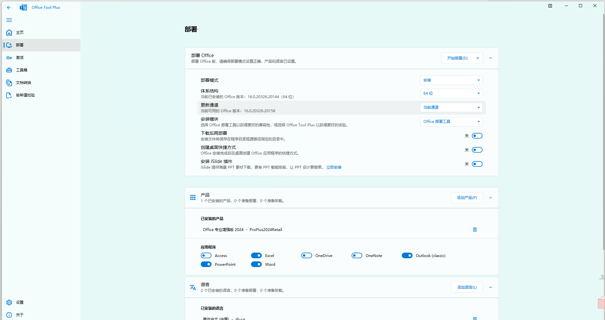
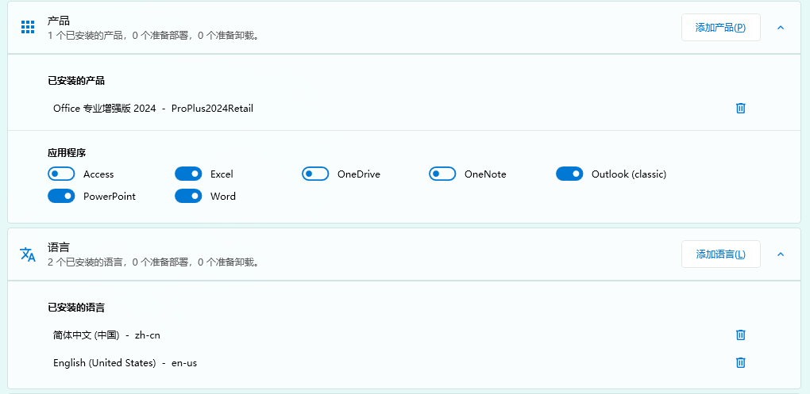
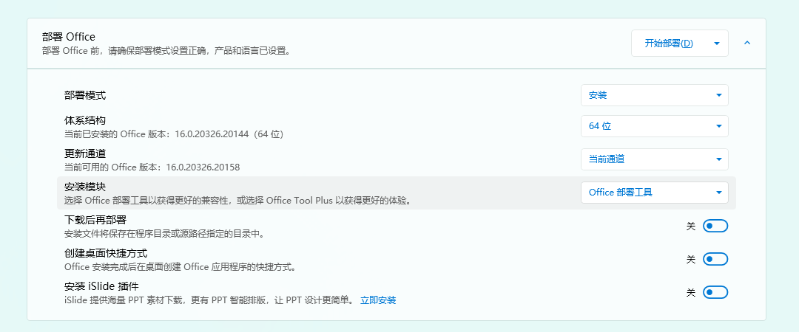
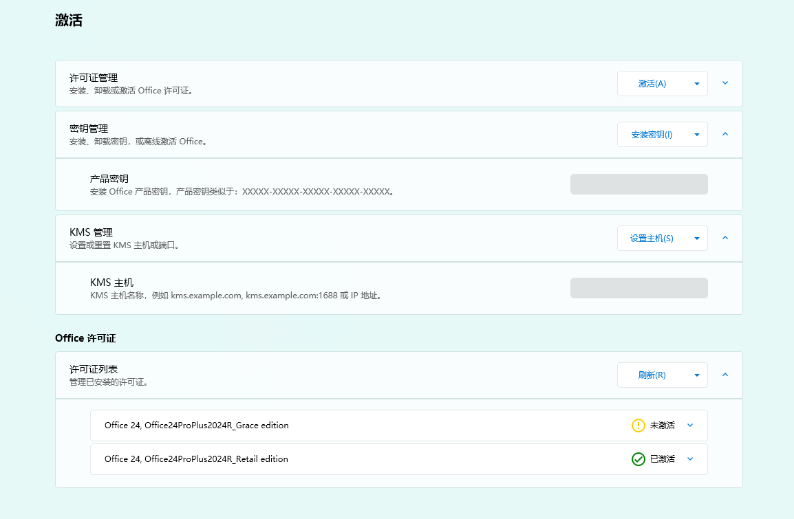
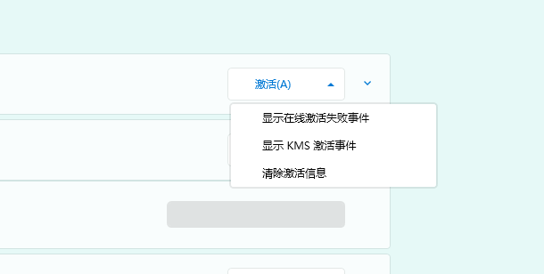

## 1 基础介绍

Office Tool Plus 是一个强大且实用的 Office 部署工具。开源，免费，简单，强大。

项目开源地址：[YerongAI/Office-Tool: Office Tool Plus localization projects.](https://github.com/YerongAI/Office-Tool)

Office Tool Plus 基于 Office 部署工具制作，可以很方便地部署 Office，其内置 Downloader 引擎可帮助您更快地下载 Office。

你也可以使用 Office Tool Plus 的其他功能或者是内置的小工具，方便、快捷地管理 Office 哦！

### 目前支持的产品

- Microsoft 365
- Office 2016 - 2024
- Visio Online Plan 2 & Visio 2016 - 2024
- Project Online Desktop Client & Project 2016 - 2024
- Office 2019，2024 LTSC

## 2 安装 Office Tool Plus

请访问 [Office Tool Plus](https://www.officetool.plus/zh-cn/) 以获取下载，或者通过 GitHub 项目直接获得项目 Releases。

## 3 如何安装 Office？

（如果您电脑上没有官方版本的 Office，请阅读这一点。相反，请绕过这一点）

请打开部署页面。

点击下方“产品”按键，选择一个你希望安装的产品，这里推荐 Microsoft 365 或者 Microsoft Office 2024。

在上方展示的页面可以详细确认你需要安装的部分，比如不需要使用 Access，可以无需安装这一模块，以节省存储空间以及部署时间。

下方可以选择需要安装的语言。通常只需要中文。

完成上述步骤后选择对应的通道，并且安装模块选择 Office 部署工具。全部严格确认完成之后点击开始部署，然后静待部署即可。

## 4 如何激活？

点击标签页的激活按钮，并点击清除激活信息。

清除旧版本 Office 的设置，不清除可能会导致账户相关的许可信息无法撤销。

### 正式开始激活

步骤：

1. 安装 Office 批量许可证（Volume），无论如何，这里你都要选批量许可证。
2. 设置一个 KMS 主机地址并保存设置。

[https://monitor.yerong.org/kms/](https://monitor.yerong.org/kms/)

如果失效了，请访问：[https://monitor.yerong.org/kms/](https://monitor.yerong.org/kms/) 查看最新的 KMS 主机地址。

**！！如果刚才的激活步骤无法完成，这里还有个备用方案**

[Release HEU_KMS_Activator_v64.04.0 · zbezj/HEU_KMS_Activator](https://github.com/zbezj/HEU_KMS_Activator/releases/tag/64.0.0)

请访问该链接获取 Releases。

> 免责声明：使用该工具可能会导致 Windows Defenders 报毒，但该工具已经在 [Release HEU_KMS_Activator_v64.04.0 · zbezj/HEU_KMS_Activator](https://github.com/zbezj/HEU_KMS_Activator) 开源，并遵循开源协议，拥有 43k+ 的 star，基本无需担心安全问题。

**使用前请先关闭 Windows Defenders！！！**

打开软件之后直接选择 Office 并且激活即可。如果你的 Windows 已经完成激活，请务必取消勾选 Windows！！！

## 疑难解答

如果您有任何疑问，我已经为此文章开放评论区，您可以评论。我会根据情况进行回复。如果您有我的联系方式（WeChat，WhatsApp，Ins，QQ），可以直接向我发送信息。
