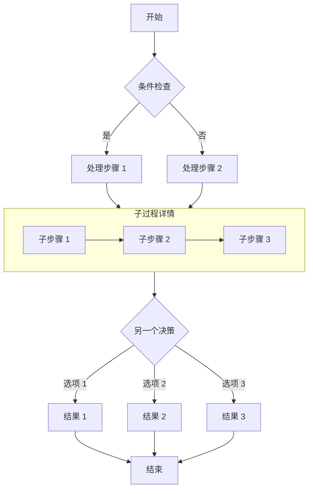

## This post has been unlocked

If you can read this, the password was correct and the post was decrypted successfully.

### How it works

- **Encryption at build time**: The article is encrypted with AES-256-GCM while the site is built. No readable copy is left in the page source.
- **Decryption in the browser**: After a visitor enters the right password, the browser decrypts the article locally through the Web Crypto API.
- **Session cache**: The password is kept in `sessionStorage` for the current browser session, so refreshing the page does not prompt for it again.
- **Cleared on close**: Closing the browser clears that cache. The password is required again on the next visit.

> The password is `123456`. It is only for testing.

## Image


## GitHub repository card

::github{repo="CuteLeaf/Firefly"}

## Callouts

> [!NOTE] NOTE
> Information the reader should take into account.

> [!TIP] TIP
> Optional information that may make the task easier.

> [!NOTE] Custom title
> This is an example with a custom title.

## Mathematical formulas
### Inline formulas

Euler's identity $e^{i\pi} + 1 = 0$ is often considered one of the most beautiful formulas in mathematics.

The mass-energy equivalence formula $E = mc^2$ is just as well known.

### Block formulas

Block formulas are wrapped in two `$$` delimiters and displayed in the centre.

$$
\int_{-\infty}^{\infty} e^{-x^2} dx = \sqrt{\pi}
$$

$$
x = \frac{-b \pm \sqrt{b^2 - 4ac}}{2a}
$$

### Chemical equations

$$
\ce{CH4 + 2O2 -> CO2 + 2H2O}
$$

## Code blocks
#### Standard syntax highlighting

```js
console.log('此代码有语法高亮!')
```

#### Rendering ANSI escape sequences

```ansi
ANSI colors:
- Regular: Red Green Yellow Blue Magenta Cyan
- Bold:    Red Green Yellow Blue Magenta Cyan
- Dimmed:  Red Green Yellow Blue Magenta Cyan

256 colors (showing colors 160-177):
160 161 162 163 164 165
166 167 168 169 170 171
172 173 174 175 176 177

Full RGB colors:
ForestGreen - RGB(34, 139, 34)

Text formatting: Bold Dimmed Italic Underline
```


## Flowchart


