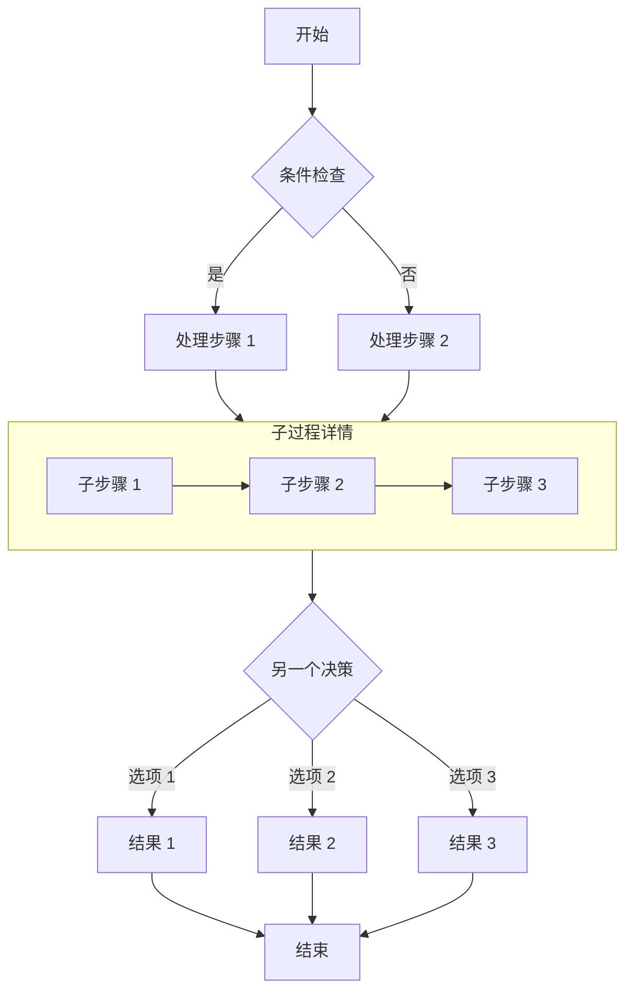
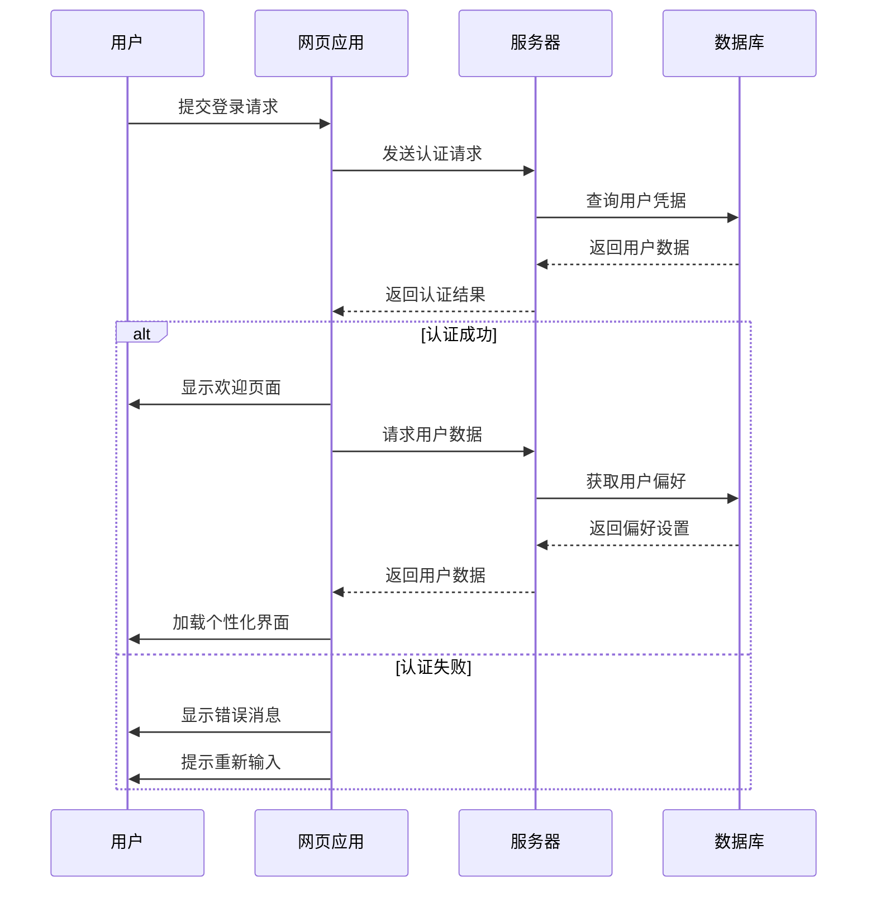
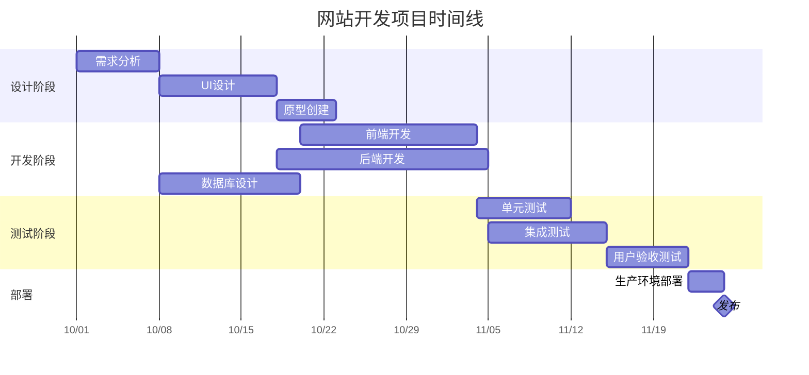
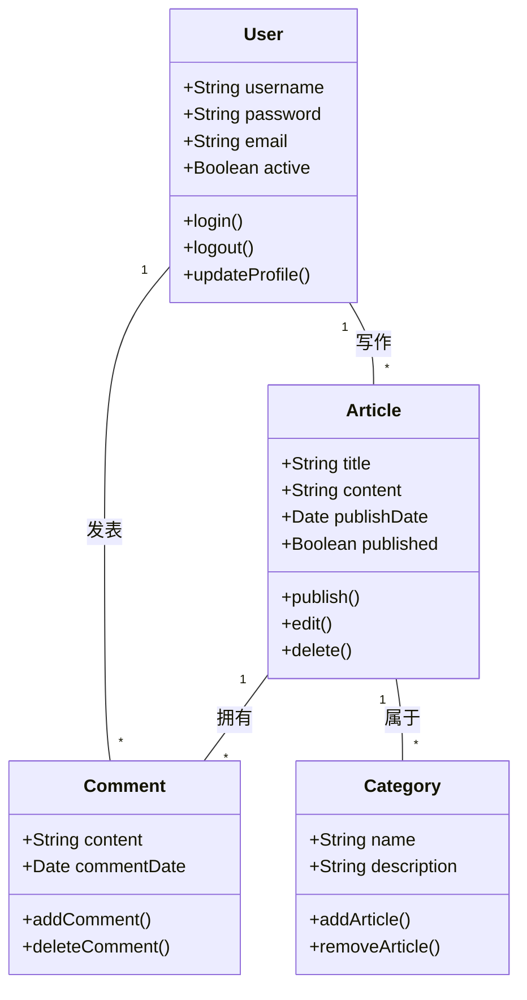
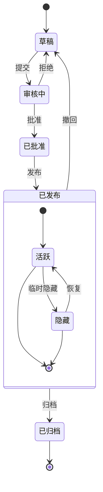
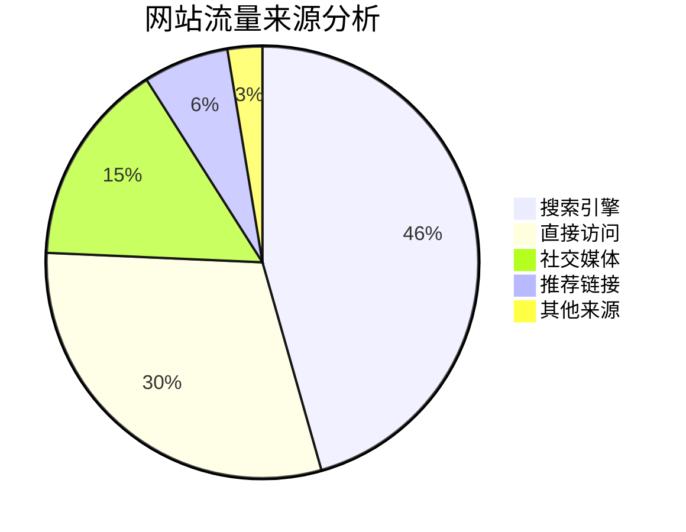

## A Practical Guide to Mermaid Diagrams in Markdown

This post shows how to build several kinds of diagrams in Markdown with Mermaid, including flowcharts, sequence diagrams, Gantt charts, class diagrams, and state diagrams.

## Flowchart Example

Flowcharts work well for processes and step-by-step algorithms.

## Sequence Diagram Example

A sequence diagram traces how objects interact over time.

## Gantt Chart Example

Gantt charts are a clear way to show a project schedule and its progress.

## Class Diagram Example

A class diagram captures a system's static structure: its classes, properties, methods, and the relationships between them.

## State Diagram Example

A state diagram follows the sequence of states an object passes through during its lifetime.

## Pie Chart Example

Pie charts are useful when the main point is the proportion each value represents.

## Summary

Mermaid is a capable way to draw diagrams without leaving a Markdown document. The examples above cover flowcharts, sequence diagrams, Gantt charts, class diagrams, state diagrams, and pie charts. Each one can make a complicated process or data structure easier to follow.

To use Mermaid, mark a fenced code block with the `mermaid` language and describe the diagram in its compact text syntax. Mermaid turns that description into the finished visual.

It is worth trying in a technical post or project document whenever a diagram can explain something more clearly than another paragraph.
