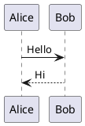
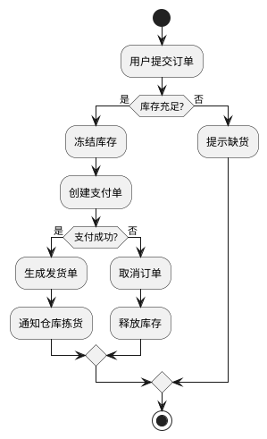
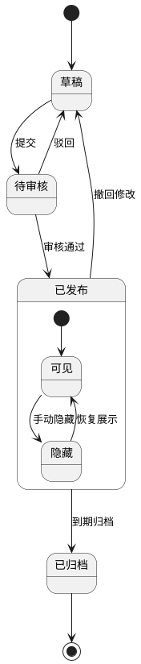
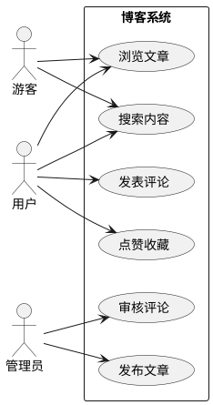
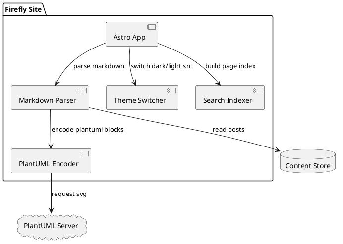
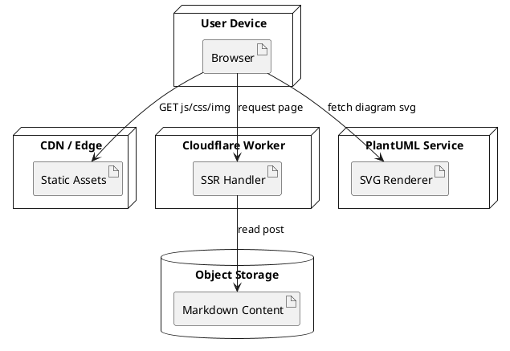
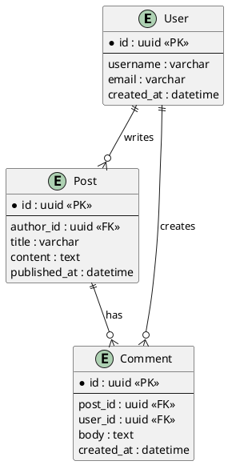
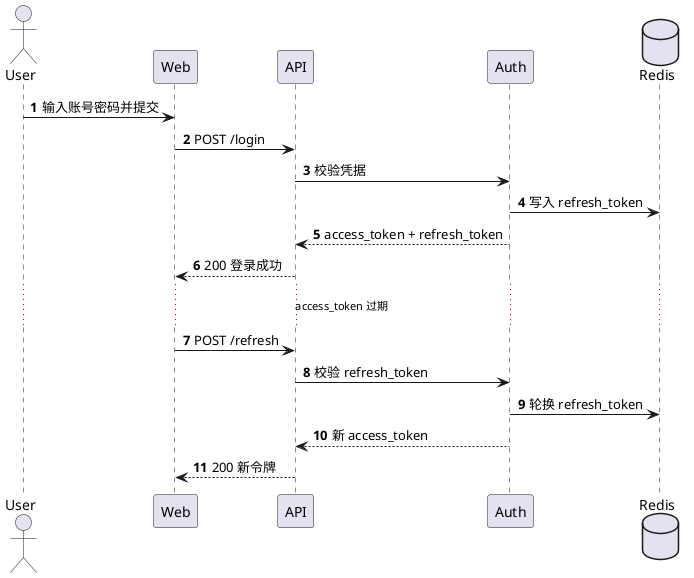

## A Guide to PlantUML Diagrams in Markdown

PlantUML turns plain-text descriptions into diagrams. A short block of structured syntax is enough to generate sequence diagrams, class diagrams, use-case diagrams, activity diagrams, and other familiar engineering visuals.

It fits technical posts and project documentation particularly well:

- Diagrams live alongside the text in version control, which makes review and collaboration easier
- Updating a diagram means editing text, so frequent revisions are painless
- It sits naturally inside Markdown and keeps the document in one consistent format

On this site, `plantuml` code blocks are encoded during the build and converted into server-hosted SVG URLs. The page switches the source automatically with the light or dark theme, and adds zoom, pan, and full-screen controls.

This minimal template is enough to get started:



## Activity Diagram Example



## State Diagram Example



## Use-Case Diagram Example



## Component Diagram Example



## Deployment Diagram Example



## ER Diagram Example



## Sequence Diagram Example: Login and Token Refresh



## C4-Style Container Diagram Example

```plantuml
@startuml
!includeurl https://raw.githubusercontent.com/plantuml-stdlib/C4-PlantUML/master/C4_Container.puml

Person(user, "博客访客", "阅读文章与搜索内容")

System_Boundary(system, "Firefly Blog") {
	Container(web, "Web App", "Astro + Svelte", "渲染页面与交互")
	Container(worker, "SSR Worker", "Cloudflare Workers", "处理服务端渲染请求")
	ContainerDb(content, "Content Store", "Markdown / Object Storage", "存储文章与资源元数据")
	Container(search, "Search Index", "Pagefind", "提供全文检索")
}

System_Ext(plantuml, "PlantUML Server", "生成 SVG 图表")

Rel(user, web, "访问", "HTTPS")
Rel(web, worker, "请求 SSR 页面", "HTTPS")
Rel(worker, content, "读取文章")
Rel(web, search, "查询关键词")
Rel(web, plantuml, "请求图表 SVG")

LAYOUT_LEFT_RIGHT()
@enduml
```
